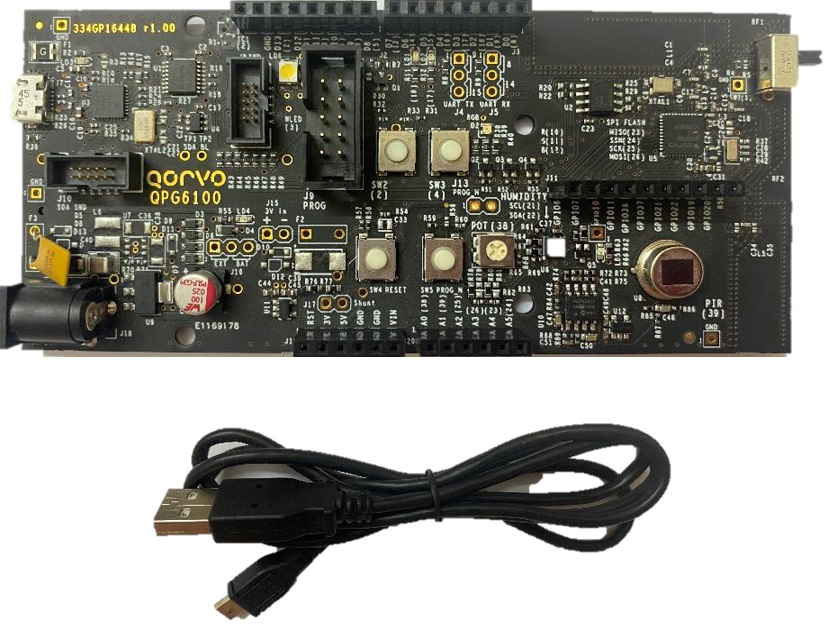

# Qorvo Thread SDKs

This repository contains the specific files needed to enable Thread on Qorvo platforms.

Example applications on the different platforms are available in the openthread repository,
which can be found under:

[https://github.com/openthread/openthread](https://github.com/openthread/openthread)

## License file

Source code in this repository is covered by the license agreement in [Qorvo_EULA.txt](Qorvo_EULA.txt).

## Description

For each of the supported platforms listed below, Qorvo provides a _Full Thread Device_ and a _Minimal Thread Device_ library,
required to build and run openthread. The ftd library supports the _Commissioner_ role, the mtd library does not.

Those libraries are located in

```
./<platform>/lib/libQorvo<platform>_ftd.a
./<platform>/lib/libQorvo<platform>_mtd.a
```

Additionally, a library for hardware supported mbedtls is provided as well on platforms that support this.

```
./<platform>/lib/libmbedtls_alt.a
```


## Supported platforms

### SoC platforms

The libraries contain the HAL code and HW accelerated mbed support (if applicable).

#### QPG6095

Thread examples are available for the QPG6095 Development Kit board.
All files required are stored in this repository under

```
./qpg6095
```

#### QPG6100

Thread examples are available for the QPG6100 Development Kit board.
All files required are stored in this repository under

```
./qpg6100
```



### Transceiver/Co-Processor platforms

These chipsets are best suited to function in the ftd role,
combined with a host platform.

#### GP712

Thread examples are available for the GP712 Evaluation kit with RaspBerry Pi.
All files required are stored in this repository under

See [GP712 usage instructions](https://github.com/openthread/openthread/blob/master/examples/platforms/gp712/README.md)
to setup an OpenThread application on these platforms.
```
./gp712
```

#### QPG7015M

Thread examples are available for the QPG7015M Evaluation kit with RaspBerry Pi.
All files required are stored in this repository under

```
./qpg7015m
```

## More information

For more information on our product line and support options
Please visit [www.qorvo.com](www.qorvo.com)
